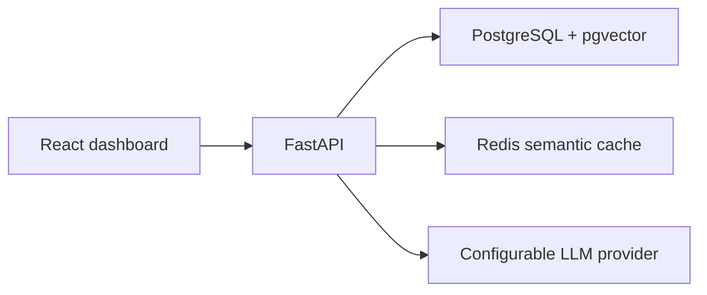

# Architecture

Multi-Tenant RAG Platform with semantic caching and cost-aware model routing.

This document is the design contract for the system. Phase 1 delivered the structure, containers, and health surface. Phase 2 delivered tenants, users, JWT authentication, and tenant-scoped authorization. Later phases implement the rest of this contract.

## Purpose

Teams in one deployment need to upload private documents, ask questions over those documents, and see answers with citations. Each tenant's documents, chunks, and cached answers stay inside that tenant. Within a tenant, document permissions further restrict who can retrieve a chunk. The platform records latency and estimated model cost, answers repeated questions from a semantic cache when that is safe, and sends simpler questions to a smaller model.

## System context



The browser never decides tenant identity or permissions. Every authenticated call resolves `user_id`, `tenant_id`, and `role` from a JWT, and services use those values.

## Principles

- Tenant isolation and permission checks live in backend services and SQL filters.
- Route functions validate input, call a service, and return a schema. Business rules stay in services.
- Persistence goes through repositories. Services do not assemble ad-hoc SQL in routers.
- Configuration lives in `app/config.py` and environment variables. API keys are not committed.
- The LLM provider is an interface. Tests use a deterministic fake provider.
- Cache reuse requires the same tenant and the same permission context.
- Prefer a small, explicit pipeline over extra frameworks.

## Containers

| Service | Role | Image |
| --- | --- | --- |
| `frontend` | React UI served by nginx. `/api` is proxied to the backend. | Node build, then nginx |
| `backend` | FastAPI application. | Python 3.11 |
| `postgres` | System of record and vector index. | `pgvector/pgvector:pg16` |
| `redis` | Semantic cache entries and counters. | Redis 7 |

`docker compose up --build` starts all four. Postgres and Redis expose health checks. The backend starts after both are healthy. The frontend starts after the backend liveness check passes.

Local development can also run the backend with uvicorn and the frontend with Vite. Vite proxies `/api` to `http://localhost:8000`.

## Backend layout

```text
backend/app/
  main.py              application factory, middleware, router mount
  config.py            environment-backed settings
  database.py          engine and session factory
  api/                 HTTP routers
  schemas/             Pydantic request and response models
  models/              SQLAlchemy models
  repositories/        database access
  security/            password hashing and JWT
  services/
    ingestion/         extract, clean, chunk, embed, persist
    retrieval/         tenant- and permission-scoped vector search
    rag/               query orchestration
    cache/             semantic cache
    routing/           small vs large model selection
    analytics/         aggregates for the dashboard
  utils/               logging and shared helpers
```

Target routers:

| Prefix | Responsibility | Phase |
| --- | --- | --- |
| `/api/health` | Liveness and readiness | 1 |
| `/api/auth` | Login and current user | 2 |
| `/api/tenants` | Tenant administration | 2 |
| `/api/documents` | Upload and document metadata | 3 |
| `/api/rag` | Question answering | 5 |
| `/api/dashboard` | Metrics for the UI | 8 |

## Identity and tenancy

Roles are `ADMIN`, `MANAGER`, and `USER`. A user belongs to exactly one tenant.

JWT claims used for authorization:

- `sub`: user id
- `tenant_id`
- `role`
- `department` when the user has one

Passwords are stored as a slow hash (bcrypt). The client may send a tenant id only as data an admin is creating; it is never the source of truth for the caller's scope.

### Document permissions

Each document has access metadata:

- `department`
- `access_level`: `public`, `internal`, or `private`
- `allowed_roles`: subset of `ADMIN`, `MANAGER`, `USER`

A chunk is retrievable only when all of the following hold:

1. `chunk.tenant_id` equals the caller's `tenant_id`.
2. The caller is an `ADMIN` of that tenant, or the caller's role is allowed for the document.
3. `public` documents are readable by every authenticated user in the tenant.
4. `internal` documents are readable by `MANAGER` and `ADMIN`.
5. `private` documents are readable only by roles listed in `allowed_roles`. `ADMIN` remains allowed inside the same tenant.
6. When the document names a department, the caller's department must match unless the caller is an `ADMIN` of the tenant.

High vector similarity cannot override a failed check. Filters are applied in the retrieval query before rows are returned.

### Planned tables

| Table | Notes |
| --- | --- |
| `tenants` | Name and slug. |
| `users` | `tenant_id`, email, password hash, role, department. |
| `documents` | `tenant_id`, filename, media type, status, ownership. |
| `document_permissions` | One row per document with department, access level, and allowed roles. |
| `document_chunks` | Text, embedding, page number, source filename, `tenant_id`, `document_id`. |
| `query_logs` | Request id, tenant, user, latency, model, cache hit, token counts, estimated cost. |

Indexes: `tenant_id`, `document_id`, `user_id`, and `created_at` on the tables that use those columns. Chunk embeddings use a pgvector index. Queries always include the tenant predicate; the vector index does not replace that predicate.

Foreign keys link users and documents to tenants, permissions and chunks to documents, and query logs to tenants and users.

## Ingestion

Supported uploads: PDF, TXT, and Markdown.

```text
upload → extract text → clean text → chunk → embed → store document, chunks, and metadata
```

Chunk metadata stored with the vector:

- `tenant_id`
- `document_id`
- `chunk_id`
- source filename
- page number when the extractor provides one
- access information copied from the document permission so retrieval can filter without a late join surprise

The embedding model and dimension are configured (`EMBEDDING_MODEL`, `EMBEDDING_DIMENSION`). The default model is `sentence-transformers/all-MiniLM-L6-v2` (384 dimensions). The `document_chunks.embedding` column is that width. A model or setting that does not match 384 is rejected before any row is written. Changing the model later requires a matching dimension and a re-embed of stored chunks.

Each chunk stores `tenant_id`, `document_id`, filename, page number for PDFs, the vector, and a copy of the document access level, department, and allowed roles. Retrieval filters on those chunk columns.

## Retrieval

The retrieval service accepts:

- query text
- `tenant_id`
- caller role and department
- optional extra permission filters from the request, which can only narrow access

It embeds the query, then runs a pgvector similarity search constrained by tenant and permission predicates, `RETRIEVAL_TOP_K`, and `RETRIEVAL_SIMILARITY_THRESHOLD`.

## RAG pipeline

```text
query
  → preprocess
  → embed
  → permission-aware retrieval
  → rank context
  → build prompt
  → route model
  → LLM
  → answer and citations
  → log
  → optional cache write
```

Semantic cache lookup happens after the query embedding exists and before the LLM call. A hit still has to pass tenant and permission checks. A hit skips the LLM and still returns citations stored with the cache entry.

`POST /api/rag/query` returns:

- `answer`
- `sources`
- `model_used`
- `cache_hit`
- `latency`
- `request_id`

## Semantic cache

Redis stores cache entries. Lookup is by embedding similarity, not by exact query string.

An entry contains:

- `tenant_id`
- query text
- query embedding
- answer
- sources
- model
- `created_at`
- `expires_at`
- permission context (role, department, and the filter set used for retrieval)

Lookup order:

1. Embed the incoming query.
2. Load candidate entries for that `tenant_id` only. Keys are prefixed by tenant id and a permission-context hash.
3. Compute cosine similarity.
4. Accept the best entry only when similarity is at least `CACHE_SIMILARITY_THRESHOLD`, the entry is unexpired, the tenant matches, and the permission context matches.
5. Otherwise treat the request as a miss.

Entries expire after `CACHE_TTL` seconds. Counters record hits, misses, estimated cost saved, and latency saved. Cost saved uses the pricing table for the model that would have been called.

The first implementation scans tenant-scoped Redis entries and computes cosine similarity in the cache service, with a bounded number of entries per tenant and permission context. That keeps isolation obvious. A dedicated vector index in Redis can replace the scan later if a tenant's cache outgrows the bound.

## Model routing and cost

`ModelRouter` scores query complexity from transparent inputs:

- query length
- sentence count
- question type
- retrieval confidence
- number of retrieved chunks
- ambiguity indicators (for example multiple entities or compare/why phrasing)

Scores at or below `ROUTING_COMPLEXITY_THRESHOLD` use `SMALL_MODEL`. Scores above it use `LARGE_MODEL`.

Prices are configuration, in USD per 1,000,000 tokens:

- `SMALL_MODEL_PRICE` / `LARGE_MODEL_PRICE` for input tokens
- `SMALL_MODEL_OUTPUT_PRICE` / `LARGE_MODEL_OUTPUT_PRICE` for output tokens

Estimated cost is `(input_tokens / 1_000_000 * input_price) + (output_tokens / 1_000_000 * output_price)`. Cache hits record the avoided cost when the stored model price is known.

Provider credentials come from `LLM_API_KEY` and `LLM_BASE_URL`. Empty keys select the fake provider so local tests and the skeleton can run.

Each LLM call records model, input tokens, output tokens, estimated cost, latency, `tenant_id`, and `cache_hit`.

## Observability

Logs are structured JSON. A RAG request log includes `request_id`, `tenant_id`, `user_id`, latency, model, `cache_hit`, retrieved chunk count, and estimated cost.

The dashboard API aggregates:

- total queries
- cache hits, misses, and hit rate
- average latency and P95 latency
- token usage
- estimated cost and estimated cost saved
- model distribution
- queries by tenant

`X-Request-ID` is attached to every HTTP response. Clients may send a request id; otherwise the API generates one.

## Frontend

React, TypeScript, Vite, and Tailwind. Routes:

| Path | Page |
| --- | --- |
| `/login` | Email and password sign-in |
| `/documents` | Upload PDF, TXT, and Markdown when the caller's role allows it |
| `/chat` | Ask a question, read the answer, citations, cache flag, and model |
| `/dashboard` | Platform metrics and tenant statistics |

Phase 1 renders these routes and talks only to the health and placeholder APIs.

## Configuration

Settings are loaded once through `get_settings()`. See `.env.example` for the variable list. In `ENVIRONMENT=production`, startup fails when `JWT_SECRET` is still the development placeholder.

## Testing strategy

Tests live in `backend/tests` and use pytest. Security behavior is covered by API tests, not only by unit tests of helpers:

- a user in tenant A cannot retrieve tenant B documents, chunks, or cached answers
- a user whose role is outside `allowed_roles` cannot retrieve a private document
- cache hits require both tenant and permission-context equality
- routing and cost use the configured thresholds and prices

Phase 1 tests cover the health endpoints, configuration guard, and the presence of the API surface.

## Security invariants

- Caller scope comes from the verified JWT.
- Retrieval and cache reads are scoped by `tenant_id` before results are returned.
- Permission metadata is enforced in the retrieval service.
- Cache entries store the permission context required to reuse them.
- Logs and health payloads omit secrets and raw connection strings.
- `.env` is gitignored. `.env.example` contains placeholders only.

## What Phase 1 delivers

Phase 1 is infrastructure and a walking skeleton:

- this architecture and `PROJECT_PLAN.md`
- the directory layout above
- settings, structured logging, request ids, and `/api/health/live` plus `/api/health/ready`
- placeholder routers for auth, tenants, documents, RAG, and dashboard
- SQLAlchemy base and an Alembic environment with no domain tables yet
- React shell with login, upload, chat, and dashboard routes
- Docker Compose for frontend, backend, Postgres with the `vector` extension created on first database init, and Redis

Authentication, document ingestion, and permission-aware retrieval are implemented. RAG, caching, routing, metrics, and evaluation are specified here and implemented in the phases that follow. `documents`, `document_chunks`, and `document_permissions` exist through Alembic revision `0003_document_permissions`. `query_logs` is still planned.
